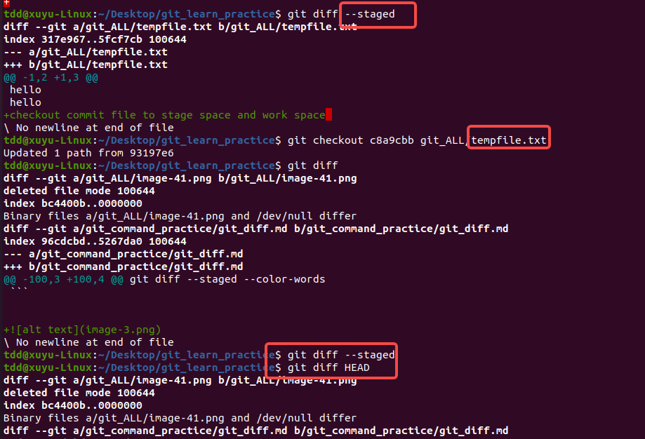

当工作区和暂存区均有文件改动时进行分支切换，会有不同的情况和相应的处理方式，下面为你详细介绍：

### 情况一：工作区和暂存区的修改不影响目标分支文件
如果工作区和暂存区的修改内容不会与目标分支上的文件产生冲突，Git允许直接切换分支。此时，工作区和暂存区的修改会被保留。

#### 示例操作
假设当前处于 `feature` 分支，工作区和暂存区都有文件修改，现在要切换到 `master` 分支。
```bash
# 查看当前所在分支
git branch
# 切换分支
git checkout master
```

### 情况二：工作区的修改影响目标分支文件
如果工作区的修改涉及到目标分支中同名文件且内容有冲突，Git 会阻止切换分支，并给出错误提示。

#### 示例及错误信息
```bash
# 假设在 feature 分支修改了 file.txt 文件
# 尝试切换到 master 分支
git checkout master
# 可能会出现类似如下错误信息
error: Your local changes to the following files would be overwritten by checkout:
        file.txt
Please commit your changes or stash them before you switch branches.
Aborting
```
#### 解决办法
- **方法一：提交修改**
将工作区的修改添加到暂存区并提交到当前分支，然后再切换分支。
```bash
# 将工作区的修改添加到暂存区
git add .
# 提交暂存区的修改
git commit -m "Save changes before switching branches"
# 切换分支
git checkout master
```
- **方法二：使用 `git stash` 暂存修改**
`git stash` 可以将当前工作区和暂存区的修改保存到一个栈中，使工作区回到干净状态，之后就可以顺利切换分支。
```bash
# 暂存工作区和暂存区的修改
git stash
# 切换分支
git checkout master
# 如果之后想回到原来的分支并恢复修改
git checkout feature
git stash pop
```

### 情况三：暂存区的修改影响目标分支文件
如果暂存区的修改涉及到目标分支中同名文件且内容有冲突，Git 同样会阻止切换分支，并给出相应提示。处理方式和工作区修改影响目标分支文件时类似，可以选择提交修改或者使用 `git stash` 暂存修改。

总之，在工作区和暂存区有文件改动时切换分支，需要确保不会对目标分支造成冲突，否则要先处理好当前的修改。 




### `git branch -b newbranch` 命令解释
`git branch -b newbranch` 实际上是一个不完整的命令，完整的写法通常是 `git branch -b newbranch <start-point>` ，如果省略 `<start-point>`，默认以当前所在分支的最新提交（`HEAD` 指向的提交）作为新分支的起点；而 `-b` 选项的作用是创建并切换到新分支，其等同于先执行 `git branch newbranch` （创建新分支），再执行 `git checkout newbranch` （切换到新分支）。

### 新分支的初始状态
新创建的 `newbranch` 分支初始状态如下：
- **提交历史**：新分支 `newbranch` 会继承 `<start-point>` （通常是当前分支的最新提交）的提交历史，也就是说，新分支和起始点所在分支在创建时刻拥有相同的提交记录。
- **文件内容**：新分支下文件的内容和 `<start-point>` 对应的提交时刻的文件内容一致。

### 当前分支工作区和暂存区有修改时新分支的情况
- **工作区修改**：工作区的修改是未被 Git 记录的临时更改，这些修改不会随着分支的创建而复制到新分支。新分支创建后，工作区的修改仍然保留在当前的工作目录中，并且会显示在新分支下。因为工作区是独立于分支概念的，它只是文件系统上的实际文件状态。
- **暂存区修改**：暂存区的修改也不会直接转移到新分支。暂存区是用于准备提交的区域，它和具体的分支没有直接关联。新分支创建后，暂存区的内容保持不变，你在新分支下仍然可以对暂存区的内容进行提交等操作。

### 示例说明
假设你当前处于 `master` 分支，并且对 `test.txt` 文件做了一些修改，同时将部分修改添加到了暂存区：
```bash
# 在 master 分支修改 test.txt 文件
echo "New content" >> test.txt
# 将部分修改添加到暂存区
git add test.txt
# 创建并切换到新分支 newbranch
git branch -b newbranch
```
此时，在 `newbranch` 分支下：
- 工作区中 `test.txt` 文件包含你之前在 `master` 分支所做的修改。
- 暂存区中仍然保留着之前在 `master` 分支添加的对 `test.txt` 文件的部分修改，你可以继续执行 `git commit` 命令将暂存区的内容提交到 `newbranch` 分支。 