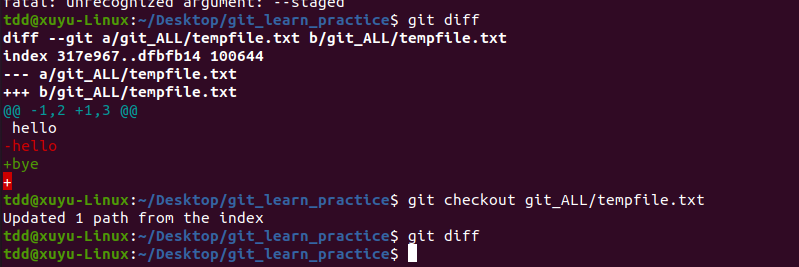

在 Git 里，`git checkout [file]` 这一命令确实可以把暂存区里指定的文件恢复到工作区。下面为你详细介绍该命令的使用、原理以及一些相关注意事项。

### 命令作用原理
在 Git 的文件管理体系中，文件状态会经历工作区、暂存区和本地仓库三个阶段。当你使用 `git add [file]` 命令时，是把工作区里的文件改动添加到了暂存区。而 `git checkout [file]` 命令的作用就是撤销这个操作，将暂存区里该文件的内容覆盖到工作区，让工作区的文件状态和暂存区保持一致。

### 使用示例
假设你在项目里有一个名为 `example.txt` 的文件，并且对它做了修改，然后把这些修改添加到了暂存区：
```bash
# 编辑 example.txt 文件
echo "New line" >> example.txt
# 将修改添加到暂存区
git add example.txt
```
要是你想撤销将 `example.txt` 添加到暂存区的操作，也就是让工作区的 `example.txt` 恢复到暂存区的状态，就可以使用下面的命令：
```bash
git checkout example.txt
```
执行完这个命令之后，工作区的 `example.txt` 文件内容就会和执行 `git add` 之前暂存区里该文件的内容一样了。

### 注意事项
- **丢失工作区修改**：使用 `git checkout [file]` 命令会让工作区里该文件未添加到暂存区的修改丢失，因为它是用暂存区的内容覆盖工作区的内容。所以在执行这个命令之前，要确保你确实想丢弃工作区的这些修改。
- **版本问题**：这里恢复的是暂存区的文件内容，而非某个特定提交版本的内容。如果想从某个提交版本恢复文件，可以使用 `git checkout <commit> [file]` 命令。 