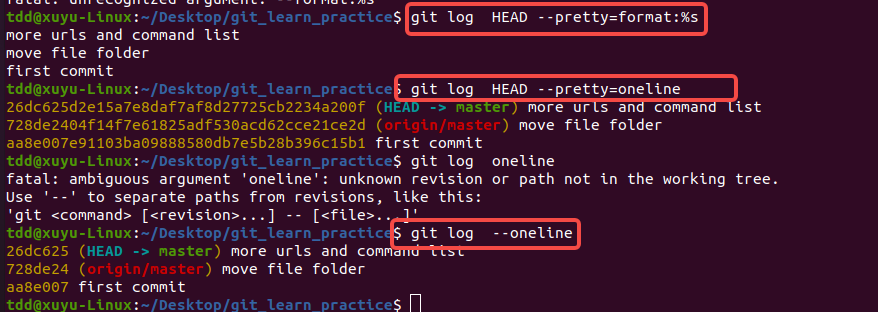
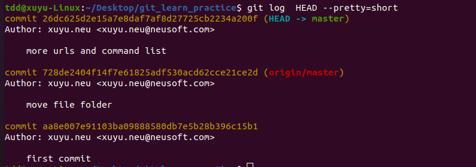

# 显示某个commit之后的所有变动，每个commit占据一行
$ git log [tag] HEAD --pretty=format:%s

### 命令解释

你给出的这个 `git log` 命令主要用于显示指定范围（从某个 `tag` 到当前 `HEAD`）内所有提交（commit）的简短信息，并且每个提交信息占据一行。下面对命令的各个部分进行详细解释：

- **`git log`**：这是 Git 用于查看提交历史记录的基础命令。
- **`[tag]`**：这里的 `[tag]` 代表一个标签名。标签通常用于标记代码仓库中的特定版本，比如发布版本。在实际使用时，你需要将 `[tag]` 替换为具体的标签名称，它指定了提交历史记录的起始点。
- **`HEAD`**：`HEAD` 指向当前所在的提交，通常是当前分支的最新提交。它在这里表示提交历史记录的结束点。
- **`--pretty=format:%s`**：
    - `--pretty` 选项用于指定输出格式。
    - `format:%s` 是一种自定义的输出格式，其中 `%s` 代表提交信息的主题（subject），也就是 `git commit` 时填写的简短描述。通过这种格式，输出结果会只显示每个提交的主题信息，并且每个提交信息占一行。

### 使用示例

假设你有一个代码仓库，并且已经打了一个名为 `v1.0` 的标签，你想要查看从 `v1.0` 标签之后到当前 `HEAD` 的所有提交的简短信息，可以使用以下命令：

```bash
git log v1.0 HEAD --pretty=format:%s
```

运行这个命令后，Git 会输出从 `v1.0` 标签之后到当前最新提交的每个提交的主题信息，每行一个提交，示例输出可能如下：

```plaintext
Fix bug in user authentication
Add new feature: user profile page
Optimize database query performance
```

### 注意事项

- 如果省略 `[tag]`，则默认从仓库的初始提交开始显示所有提交信息。例如：
```bash
git log HEAD --pretty=format:%s
```
这个命令会显示从仓库创建到当前 `HEAD` 的所有提交的主题信息。

- 如果 `[tag]` 和 `HEAD` 之间没有提交，命令将不会输出任何内容。

- 你还可以根据需要调整 `--pretty` 选项的格式，例如 `%h` 表示提交的简短哈希值，`%an` 表示作者姓名等。示例：
```bash
git log v1.0 HEAD --pretty=format:"%h %s"
```
这个命令会输出每个提交的简短哈希值和主题信息，类似如下输出：
```plaintext
abc123 Fix bug in user authentication
def456 Add new feature: user profile page
ghi789 Optimize database query performance
``` 




在 `git log` 命令中，`--pretty` 选项允许你自定义提交日志的输出格式，使你能够以更符合需求的方式查看提交信息。以下是一些常见的 `--pretty` 选项格式及其说明：

### 预定义格式
- **`--pretty=oneline`**
    - **说明**：将每个提交信息显示在一行上，只包含提交的简短哈希值和提交主题。
    - **示例命令**：`git log --pretty=oneline`
    - **示例输出**：
```plaintext
abc1234 Fix bug in user authentication
def5678 Add new feature: user profile page
```
- **`--pretty=short`**
    - **说明**：显示提交的哈希值、作者和提交主题，比 `oneline` 格式提供更多信息。
    - **示例命令**：`git log --pretty=short`
    - **示例输出**：
```plaintext
commit abc1234
Author: John Doe
    Fix bug in user authentication

commit def5678
Author: Jane Smith
    Add new feature: user profile page
```
- **`--pretty=full`**
    - **说明**：显示提交的哈希值、作者、提交者和提交主题。
    - **示例命令**：`git log --pretty=full`
    - **示例输出**：
```plaintext
commit abc1234
Author: John Doe
Commit: John Doe
    Fix bug in user authentication

commit def5678
Author: Jane Smith
Commit: Jane Smith
    Add new feature: user profile page
```
- **`--pretty=fuller`**
    - **说明**：显示提交的哈希值、作者、作者日期、提交者、提交日期和提交主题，提供最详细的信息。
    - **示例命令**：`git log --pretty=fuller`
    - **示例输出**：
```plaintext
commit abc1234
Author:     John Doe <johndoe@example.com>
AuthorDate: Mon Sep 11 12:00:00 2023 +0800
Commit:     John Doe <johndoe@example.com>
CommitDate: Mon Sep 11 12:00:00 2023 +0800
    Fix bug in user authentication

commit def5678
Author:     Jane Smith <janesmith@example.com>
AuthorDate: Tue Sep 12 13:00:00 2023 +0800
Commit:     Jane Smith <janesmith@example.com>
CommitDate: Tue Sep 12 13:00:00 2023 +0800
    Add new feature: user profile page
```

### 自定义格式
你可以使用 `--pretty=format:"<format>"` 来定义自己的输出格式，其中 `<format>` 可以包含以下占位符：
- **`%H`**：提交的完整哈希值。
- **`%h`**：提交的简短哈希值。
- **`%T`**：树对象的完整哈希值。
- **`%t`**：树对象的简短哈希值。
- **`%P`**：父提交的完整哈希值。
- **`%p`**：父提交的简短哈希值。
- **`%an`**：作者姓名。
- **`%ae`**：作者邮箱。
- **`%ad`**：作者日期（可通过 `--date` 选项指定日期格式）。
- **`%ar`**：作者日期，相对格式（如 “2 weeks ago”）。
- **`%cn`**：提交者姓名。
- **`%ce`**：提交者邮箱。
- **`%cd`**：提交日期。
- **`%cr`**：提交日期，相对格式。
- **`%s`**：提交主题。
- **`%b`**：提交正文。

**示例命令**：`git log --pretty=format:"%h %an %ad %s" --date=short`
**示例输出**：
```plaintext
abc1234 John Doe 2023-09-11 Fix bug in user authentication
def5678 Jane Smith 2023-09-12 Add new feature: user profile page
```

这个自定义格式显示了提交的简短哈希值、作者姓名、作者日期（短格式）和提交主题。