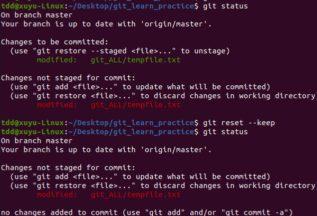

在执行 `git reset --keep` 命令后暂存区文件被重置，原因如下：

### `git reset` 命令原理
`git reset` 命令主要用于回退版本，可以移动 `HEAD` 指针以及重置暂存区状态。它有几种不同的模式，常见的参数有 `--soft`、`--mixed`（默认）和 `--hard`，而 `--keep` 也是一种操作模式。

### 不同模式下对暂存区的影响
- **`--soft`**：只移动 `HEAD` 指针，指向指定的提交，暂存区和工作区的内容都不会改变 。也就是说，之前暂存的内容依然在暂存区，工作区的修改也保持不变。
- **`--mixed`（默认）**：不仅移动 `HEAD` 指针，还会重置暂存区，使其内容与 `HEAD` 指向的提交一致，但工作区的内容不会被改动 。所以执行 `git reset` （等同于 `git reset --mixed` ）后，暂存区中之前暂存的修改会被取消，回到未暂存状态，而工作区的文件还是保持修改后的样子。
- **`--hard`**：这是一种比较危险的操作，它会同时移动 `HEAD` 指针、重置暂存区和工作区，让工作区的内容完全与 `HEAD` 指向的提交一致 。这意味着工作区中未提交的修改都会丢失。
- **`--keep`**：移动 `HEAD` 指针并重置暂存区，和 `--mixed` 类似，会取消暂存区的修改 。同时，它会尝试保留工作区的修改，如果工作区的修改与重置后的状态冲突，Git 会提示冲突，需要手动解决。

在你提供的操作中，执行 `git reset --keep` 后，暂存区中 `git_ALL/tempfile.txt` 文件的暂存状态被取消，所以在再次执行 `git status` 时，该文件显示为 “Changes not staged for commit”（未暂存的修改），处于工作区修改状态。 

